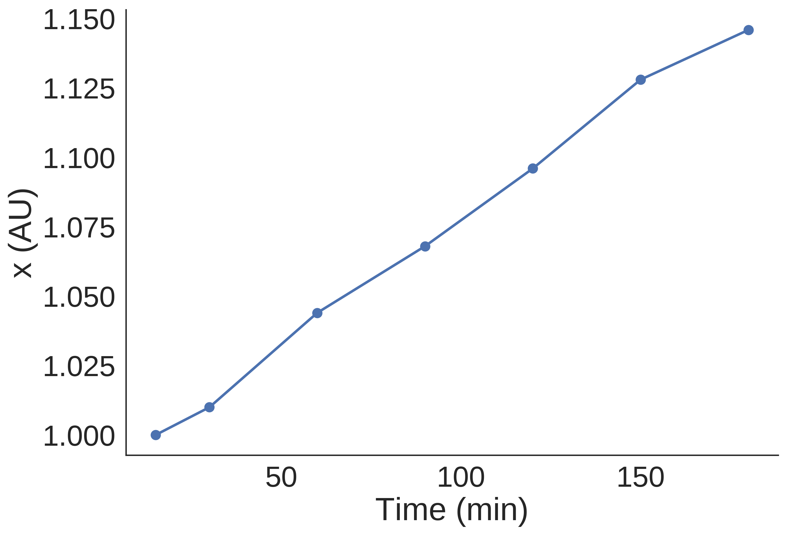
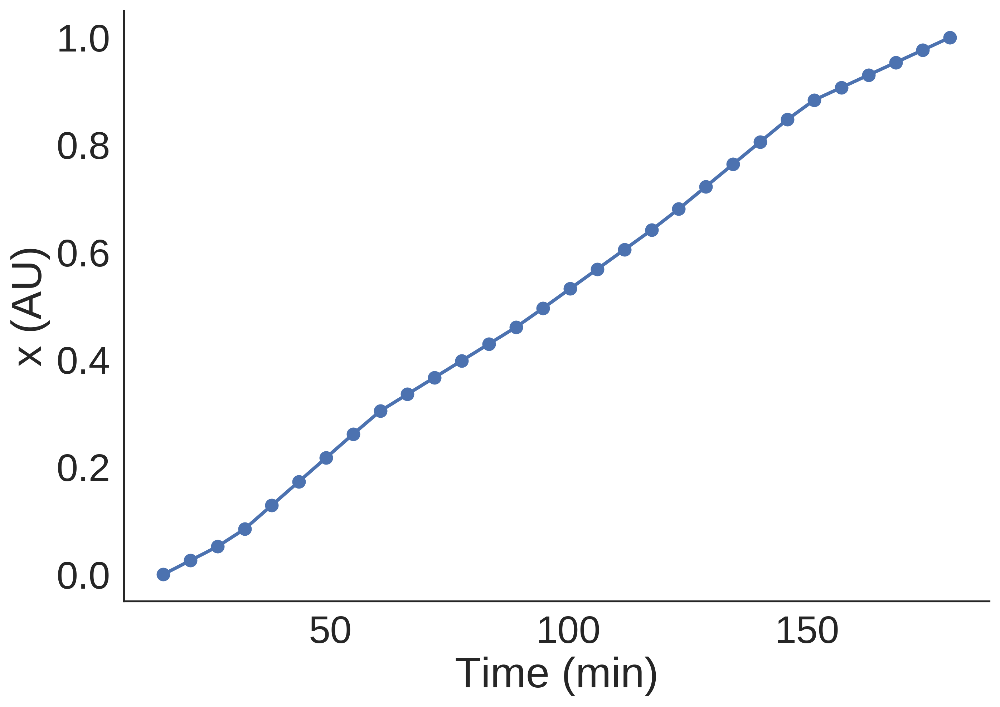
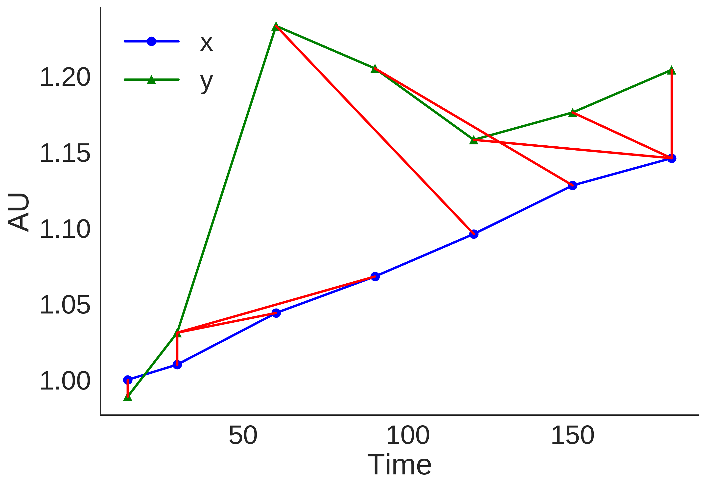
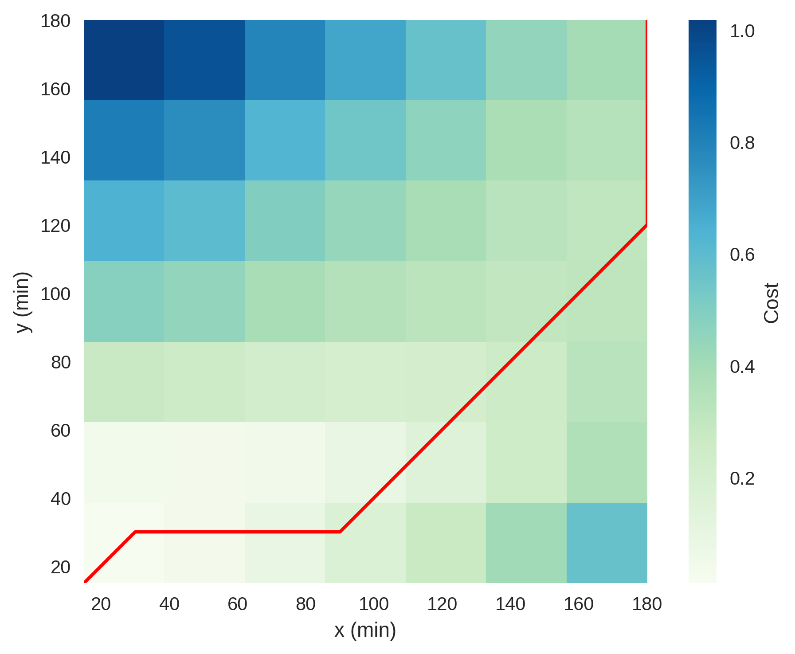
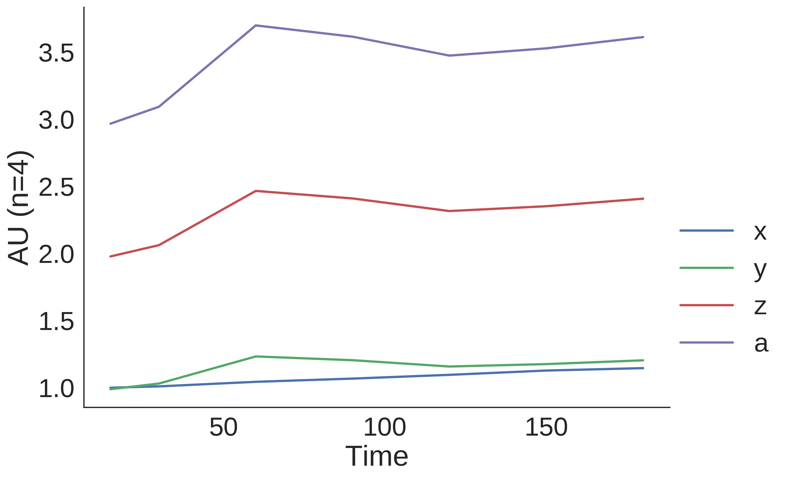
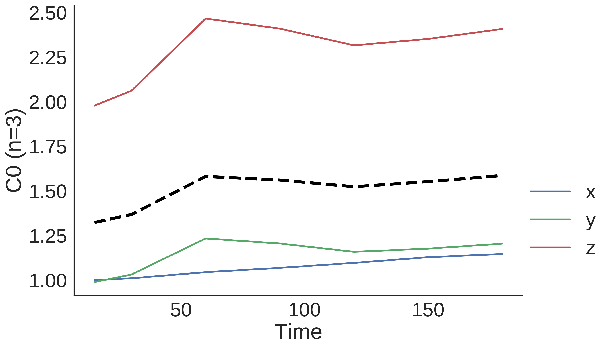

Quick Start
===========

Create a :py:class:`pytseries.core.TimeSeries` object
-----------------------------------------------------

.. code-block:: python 

   >>> from pytseries.core import TimeSeries 
   >>> time = [15, 30, 60, 90, 120, 150, 180]
   >>> x_values = [1, 1.01, 1.044, 1.068, 1.096, 1.128, 1.1459]
   >>> ts = TimeSeries(time=time, values=x_values, feature='x')
   >>> print(ts)
   out: TimeSeries(data=[1.0, 1.01, 1.044, 1.068, 1.096, 1.128, 1.1459], time=[15, 30, 60, 90, 120, 150, 180], feature="x")

Plot a :py:class:`pytseries.core.TimeSeries` object
---------------------------------------------------
Note that we have interpolated our TimeSeries so that now we have 30 points. 

.. code-block:: python

   >>> ts.plot()

Normalise and interpolate :py:class:`pytseries.core.TimeSeries` object
----------------------------------------------------------------------

.. code-block:: python

   >>> ts.interpolate(kind='linear', num=30, inplace=True)
   >>> ts.norm(inplace=True) 
   >>> len(ts)
   out: 30 ## now we have 30 data point
   >> ts.max() ## now our min is 0 and max is 1
   out: (180.0, 1.0)
   >>> ts.plot()

Compute dynamic time warping distance between two :py:class:`pytseries.core.TimeSeries` objects
-----------------------------------------------------------------------------------------------

.. code-block:: python

   >>> from pytseries.core import TimeSeries
   >>> from pytseries.dtw import DTW
   >>> time = [15, 30, 60, 90, 120, 150, 180]
   >>> x_values = [1, 1.01, 1.044, 1.068, 1.096, 1.128, 1.1459]
   >>> y_values = [0.989, 1.031, 1.233, 1.205, 1.158, 1.176, 1.204]
   >>> tsx = TimeSeries(time=time, values=x_values, feature='x')
   >>> tsy = TimeSeries(time=time, values=y_values, feature='y')
   >>> dtwxy = DTW(x=tsx, y=tsy)
   >>> dtwxy
   out: DTW(x=x, y=y, cost=0.4073)
   >>> dtwxy.cost
   out: 0.40730000000000044
   >>> dtwxy.plot()

.. code-block:: python
   
   >>> dtwxy.cost_plot()

Create a :py:class:`pytseries.core.TimeSeriesGroup` Object
----------------------------------------------------------

.. code-block:: python

   >>> time = [15, 30, 60, 90, 120, 150, 180]
   >>> x_values = [1, 1.01, 1.044, 1.068, 1.096, 1.128, 1.1459]
   >>> y_values = [0.989, 1.031, 1.233, 1.205, 1.158, 1.176, 1.204]
   >>> z_values = [i*2 for i in y_values]
   >>> a_values = [i*3 for i in y_values]
   >>> tsx = TimeSeries(time=time, values=x_values, feature='x')
   >>> tsy = TimeSeries(time=time, values=y_values, feature='y')
   >>> tsz = TimeSeries(time=time, values=z_values, feature='z')
   >>> tsa = TimeSeries(time=time, values=a_values, feature='a')

Create a :py:class:`pytseries.core.TimeSeriesGroup` using a list of :py:class:`pytseries.core.TimeSeries`
---------------------------------------------------------------------------------------------------------

.. code-block:: python

   >>> from pytseries.core import TimeSeriesGroup
   >>> tsg = TimeSeriesGroup([tsx, tsy, tsz, tsa])
   >>> tsg
   out: 15     30     60     90     120    150     180
   x  1.000  1.010  1.044  1.068  1.096  1.128  1.1459
   y  0.989  1.031  1.233  1.205  1.158  1.176  1.2040
   a  2.967  3.093  3.699  3.615  3.474  3.528  3.6120
   z  1.978  2.062  2.466  2.410  2.316  2.352  2.4080  

TimeSeriesGroup clustering
--------------------------

.. code-block:: python

   >>> from pytseries.clust import TimeSeriesKMeans
   >>> c = TimeSeriesKMeans(tsg, n_clusters=2, max_iter=4)
   >>> fig = c.plot_clusters()
   Out: 4.913 --> 1.643 --> 1.643 --> 
   

